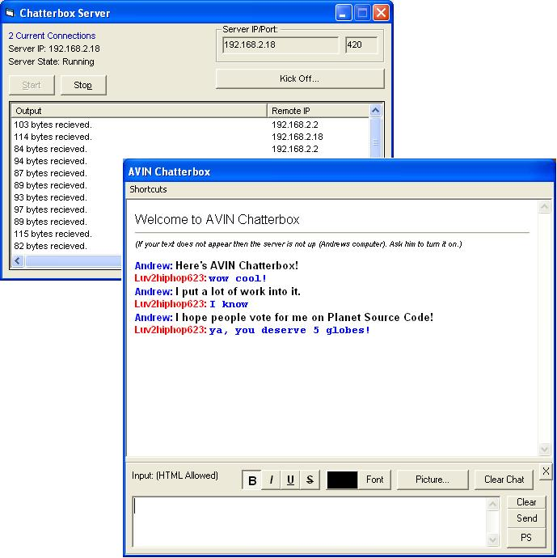



## AVIN Chatterbox

### Description

This awesome program allows you to talk with TCP/IP over a network like a chatroom. You can have unlimited users too! Comes complete with server and client programs. You can also post animated pictures, change the fonts, and much more! It actually writes the chat as a WEBPAGE! So anything you can do with a webpage, you can do with this! It also remembers personal settings for later use!

Other options include kicking users off through the server, private messaging, AIM sounds, Color Sorting and more!

Make sure you start the server before starting the client!

Vote for ME!
 
### More Info
 

             |
---                |---
**Submitted On**   |2002-11-13 19:42:12
**By**             |[Pnut V](https://github.com/Planet-Source-Code/PSCIndex/blob/master/ByAuthor/pnut-v.md)
**Level**          |Intermediate
**User Rating**    |4.8 (82 globes from 17 users)
**Compatibility**  |VB 3\.0, VB 4\.0 \(16\-bit\), VB 4\.0 \(32\-bit\), VB 5\.0, VB 6\.0, VB Script, ASP \(Active Server Pages\) , VBA MS Access, VBA MS Excel
**Category**       |[Complete Applications](https://github.com/Planet-Source-Code/PSCIndex/blob/master/ByCategory/complete-applications__1-27.md)
**World**          |[Visual Basic](https://github.com/Planet-Source-Code/PSCIndex/blob/master/ByWorld/visual-basic.md)
**Archive File**   |[AVIN\_Chatt14968911132002\.zip](https://github.com/Planet-Source-Code/pnut-v-avin-chatterbox__1-40692/archive/master.zip)

